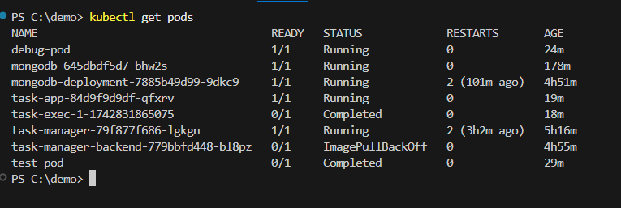
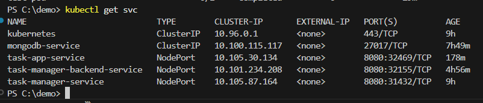
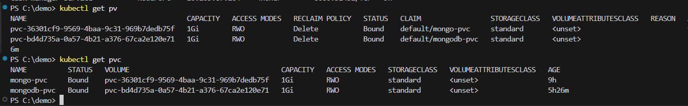
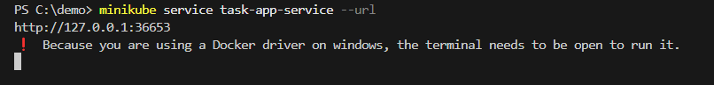
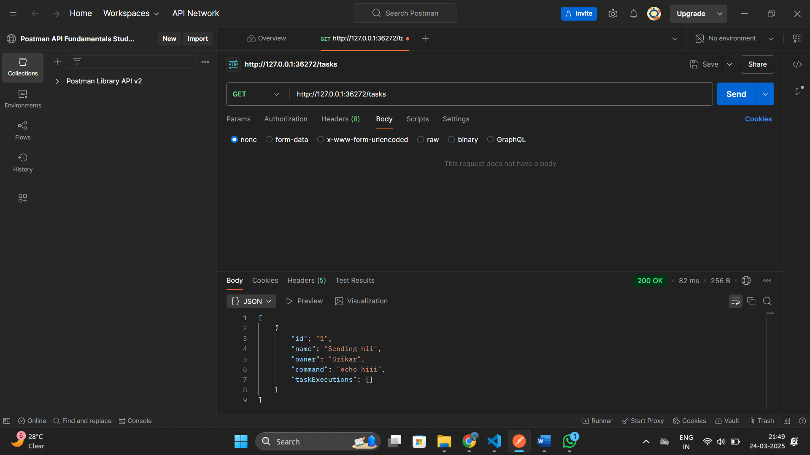
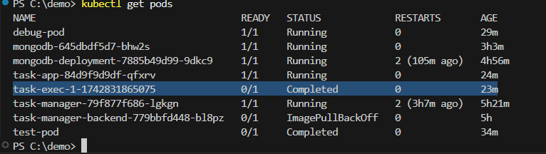

# Kubernetes Deployment

## Overview
This task involves deploying the Java backend application and MongoDB database to a Kubernetes cluster using Kubernetes manifests. The application is configured to execute shell commands inside dynamically created Kubernetes pods.

## Prerequisites
- Minikube (or any Kubernetes cluster)
- Docker
- kubectl (Kubernetes CLI)
- Helm (for MongoDB deployment)
- DockerHub account (for pulling the application image)

## Steps to Deploy

### 1. Build and Push Docker Images
Since we are using DockerHub, ensure that your image is built and pushed:

```sh
# Navigate to the backend directory
cd demo

# Build the artifact using

mvn clean package -Dmaven.test.skip=true

# Build Docker image
docker build -t <your-dockerhub-username>/task-manager-backend:latest .

# Push to DockerHub
docker push <your-dockerhub-username>/task-manager-backend:latest
```

### 2. Start Minikube (If Using Minikube)

```sh
minikube start
```

### 3. Deploy MongoDB
We are using a Helm chart to deploy MongoDB with a persistent volume:

```sh
helm repo add bitnami https://charts.bitnami.com/bitnami
helm install mongodb bitnami/mongodb --set persistence.enabled=true
```

### 4. Apply Kubernetes Manifests

Ensure that your `deployment.yaml` and `service.yaml` files are correctly placed in your project directory. Apply them using:

```sh
kubectl apply -f task-app-deployment.yaml
kubectl apply -f service.yaml
kubectl apply -f mongo-deployment.yaml
```

### 5. Verify Deployment

Check if the pods are running:

```sh
kubectl get pods
```

Get the list of services:

```sh
kubectl get svc
```

### 6. Access the Application
Retrieve the application URL if using Minikube:

```sh
minikube service task-manager-service --url
```

Test an endpoint:

```sh
curl http://<service-url>/api/tasks
```

### 7. Updated Task Execution
The "PUT a TaskExecution" endpoint now programmatically creates a Kubernetes pod to execute shell commands instead of running them locally. It uses a `busybox` container.

## Proof of Deployment
Ensure that you take screenshots of:
1. The output of `kubectl get pods`


2. The output of `kubectl get svc`


3. The output of `kubectl get pv` and `kubectl get pvc`


4. The output of Deployement url `minikube service task-app-service --url`


5. The output of enndpoint tesing using GET http://<minikube url>/tasks


6. The output of Pod creation after task Executing.



## Notes
- **DockerHub Usage:** Ensure your Kubernetes deployment YAML files reference the image from DockerHub:

```yaml
containers:
  - name: task-manager-backend
    image: <your-dockerhub-username>/task-manager-backend:latest
```

- **Environment Variables for MongoDB:** The application should read the MongoDB connection string from environment variables:

```yaml
env:
  - name: MONGO_URI
    value: "mongodb://mongodb:27017/taskdb"
```

## Cleanup
To remove all deployed resources:

```sh
kubectl delete -f deployment.yaml
kubectl delete -f service.yaml
helm uninstall mongodb
```

